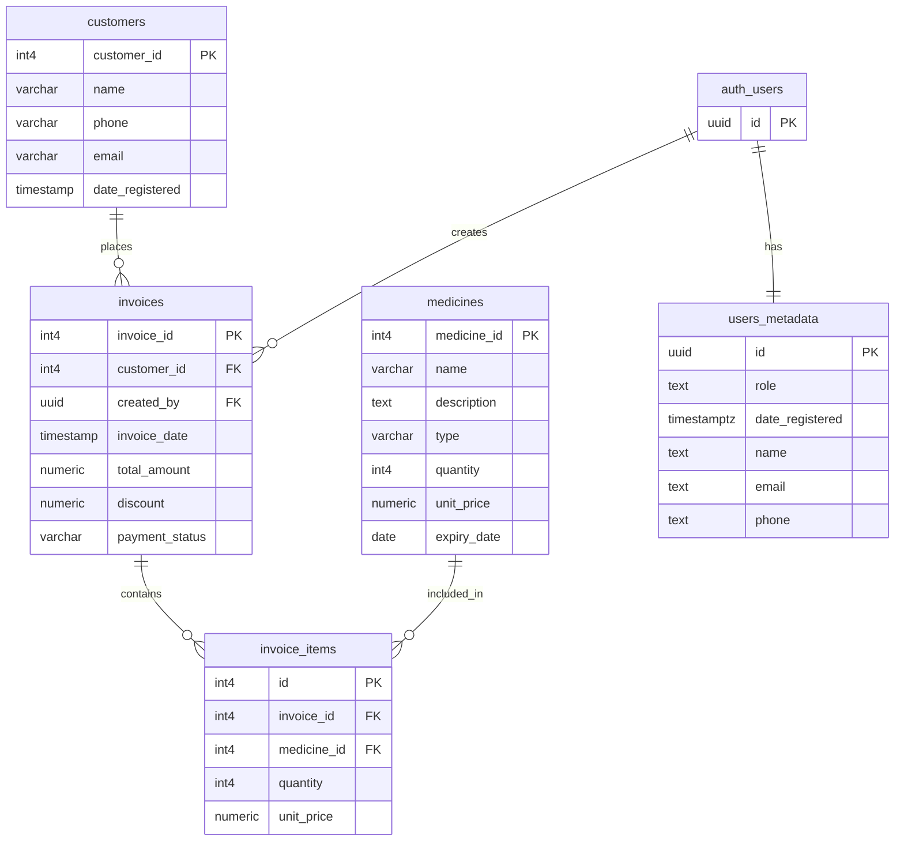

# CureVia — Pharmacy Management System


A web-based pharmacy management system built with AngularJS and Supabase.

---

## About the Project

CureVia helps pharmacy staff manage their daily operations in one place — medicines, customers, and invoices. The system supports two roles: admin and cashier, each with different levels of access.

## Tech Stack

- **AngularJS 1.8** — SPA with `ngRoute` for routing
- **Bootstrap 5.3** — UI components and responsive layout
- **Supabase** — PostgreSQL database + authentication (REST API)
- **Bootstrap Icons** — Icon set

## Features

- **Medicine Inventory** — Add, edit, and track medicines with quantity, pricing, expiry date, and form type
- **Customer Management** — Add and manage customer profiles linked to their invoice history
- **Invoices** — Create invoices with multiple line items, apply discounts, track payment status (paid / unpaid / partial). Stock auto-decrements on invoice creation
- **Dashboard** — Overview of total medicines, customers, invoices, low-stock and expired medicine alerts, and top-selling medicines
- **User Management** _(admin only)_ — Add and remove system users, assign roles
- **Role-Based Access** — Admins have full access; cashiers can manage customers, medicines, and invoices but cannot manage users
- **Search & Filter** — Live search and status filters on all list pages

## Roles

| Role    | Access                                                        |
| ------- | ------------------------------------------------------------- |
| Admin   | Everything — including user management and admin panel alerts |
| Cashier | Medicines, customers, invoices, dashboard                     |

## Routes

| Route                  | Page                        | Guard                                       |
| ---------------------- | --------------------------- | ------------------------------------------- |
| `#!/landing`           | Landing page                | Public                                      |
| `#!/about`             | About                       | Public                                      |
| `#!/contact`           | Contact                     | Public                                      |
| `#!/login`             | Login                       | Redirects to dashboard if already logged in |
| `#!/dashboard`         | Dashboard                   | Auth required                               |
| `#!/medicines`         | Medicine list               | Auth required                               |
| `#!/customers`         | Customer list               | Auth required                               |
| `#!/add-customer`      | Add customer                | Auth required                               |
| `#!/edit-customer/:id` | Edit customer               | Auth required                               |
| `#!/view-customer/:id` | View customer               | Auth required                               |
| `#!/invoices`          | Invoice list + create modal | Auth required                               |
| `#!/users`             | User management             | Admin only                                  |
| `#!/admin-panel`       | Stock & payment alerts      | Admin only                                  |

## Database Schema



## Project Structure

```
├── index.html
├── app.js                        # Routes and module config
├── style.css
├── controller/
│   ├── appController.js          # Global layout controller
│   ├── authController.js
│   ├── medicineController.js
│   ├── customerController.js
│   ├── invoiceController.js
│   ├── dashboardController.js
│   ├── adminPanelController.js
│   └── userController.js
├── service/
│   ├── authService.js
│   └── dataService.js
├── Directives/
│   ├── landingNavDirective.js    # Global navbar (appNav)
│   └── userTableDirective.js
├── views/
│   ├── appNav.html               # Shared navbar template
│   ├── landing.html
│   ├── about.html
│   ├── contact.html
│   ├── login.html
│   ├── dashboard.html
│   ├── medicines.html
│   ├── customers.html
│   ├── invoices.html
│   ├── users.html
│   ├── adminPanel.html
│   ├── addCustomer.html
│   ├── editCustomer.html
│   ├── viewCustomer.html
│   └── 404.html
└── assets/
```
