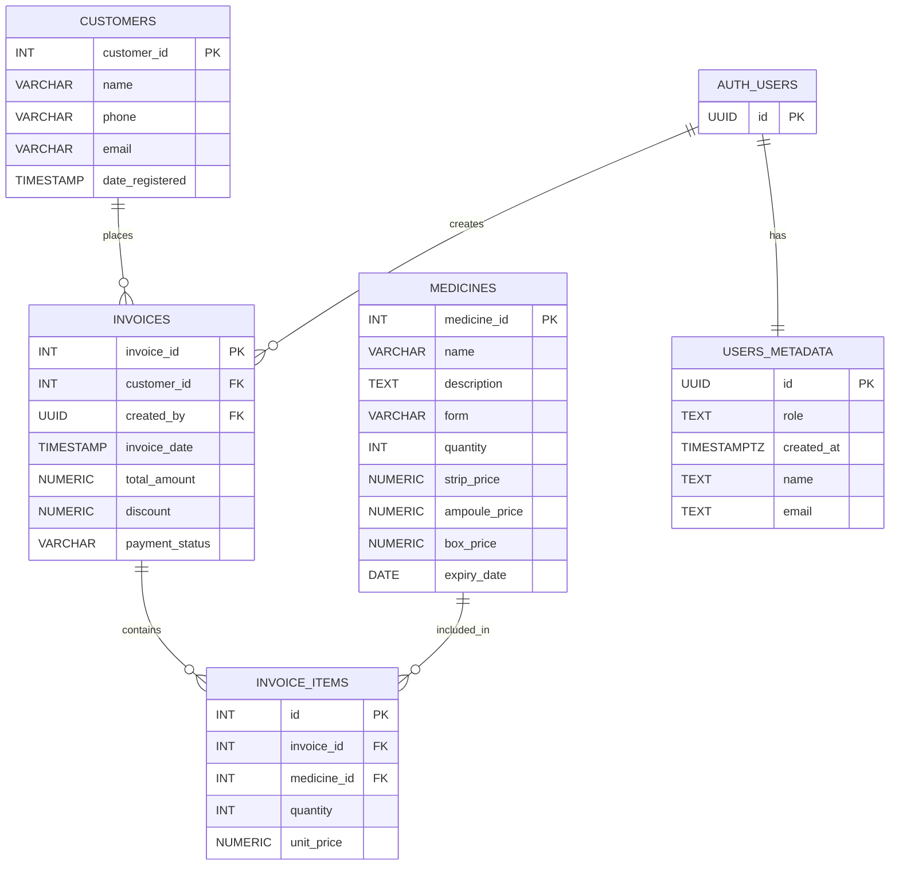

# Pharmacy Management System — Product Requirements Document

## 1. Overview

A Single Page Application (SPA) built with **AngularJS** and backed by **Supabase** for managing pharmacy operations: medicine inventory, customer records, and sales invoicing.

## 2. Goals

- Provide a simple, role-based interface for day-to-day pharmacy workflows.
- Track medicine stock
- Generate invoices with line items, discounts, and payment-status tracking.
- Support search, filtering, and routing across all views.

## 3. User Roles

| Role                   | Capabilities                                                             |
| ---------------------- | ------------------------------------------------------------------------ |
| **Admin**              | Full access — manage users, medicines, invoices, and view the dashboard. |
| **Pharmacist / Staff** | Create & view invoices, update medicine quantities, manage customers.    |

## 4. Pages & Features

| Page                               | Key Features                                                                                                                                                  |
| ---------------------------------- | ------------------------------------------------------------------------------------------------------------------------------------------------------------- |
| **Dashboard**                      | Summary cards (total medicines, customers, recent invoices, low-stock alerts).                                                                                |
| **Medicines**                      | Add / edit / delete medicines; track quantity, pricing (strip / ampoule / box), form, and expiry date.                                                        |
| **Customers**                      | Add / edit / delete customers (name, phone, email); view registration date.                                                                                   |
| **Invoices**                       | Create invoices linked to a customer; add line items (medicine, qty, unit price); apply invoice-level discount; set payment status (paid / unpaid / partial). |
| **User Management** _(Admin only)_ | Add / edit / delete users; assign roles.                                                                                                                      |

## 5. Core Functional Requirements

1. **Medicine Management** — CRUD operations on medicines; auto-decrement stock on invoice creation; flag medicines nearing expiry.
2. **Customer Management** — CRUD operations on customers; link customers to their invoice history.
3. **Invoice Creation** — Select a customer, add one or more medicines as line items, apply an optional discount, and record payment status. Total is auto-calculated.
4. **Search & Filter** — Text search and column filters on medicines, customers, and invoices lists.
5. **Authentication & Authorization** — Supabase Auth; role stored in `users_metadata`; route guards per role.

## 6. Data Model (ERD)

## 7. Tech Stack

| Layer        | Technology                                                   |
| ------------ | ------------------------------------------------------------ |
| Frontend     | AngularJS (SPA with `ngRoute`)                               |
| Backend / DB | Supabase (PostgreSQL + Auth + REST API)                      |
| Styling      | Custom CSS (Teal brand palette — see `dev-docs/Branding.md`) |

## 8. Non-Functional Requirements

- Responsive layout (desktop-first, mobile-friendly).
- Client-side form validation on all inputs.
- Loading indicators for async operations.
- Toasts / alerts for success and error feedback.
